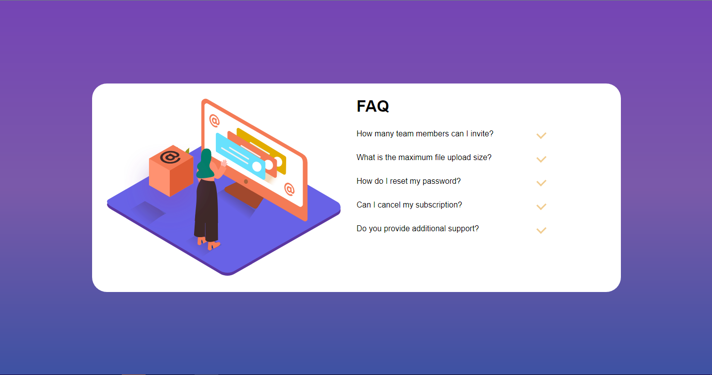

# Frontend Mentor - FAQ accordion card solution

Esta é uma solução do [FAQ accordion card challenge on Frontend Mentor](https://www.frontendmentor.io/challenges/faq-accordion-card-XlyjD0Oam). Frontend Mentor challenges ajuda você melhorar suas habilidades em fazer códigos com projetos reais.

### Telas

### Links

[Solution URL](https://kaiojesus.github.io/FAQ-Card/)

### Ferramentas

- HTML 5
- CSS
- JavaScript

### 📝 Aprendizado

Eu estou desenvolvendo minhas habilidades com o JavaScript. Aprendi algumas funções e na evolução de como chamá-las/declará-las. Estou melhorando minhas habilidades com CSS, o flexbox está saindo com mais naturalidade.

### Desenvolvimento contínuo

Não devo voltar nesse projeto por agora, ele está incompleto, preciso deixá-lo um pouco mais responsivo além de acrescentar algumas novas funcionalidades, entretanto começarei um novo projeto.

### Contato ✉

- [LinkedIn](https://www.linkedin.com/in/kaio-jesus/) 
- [kaiojesus41@gmail.com](kaiojesus41@gmail.com)

